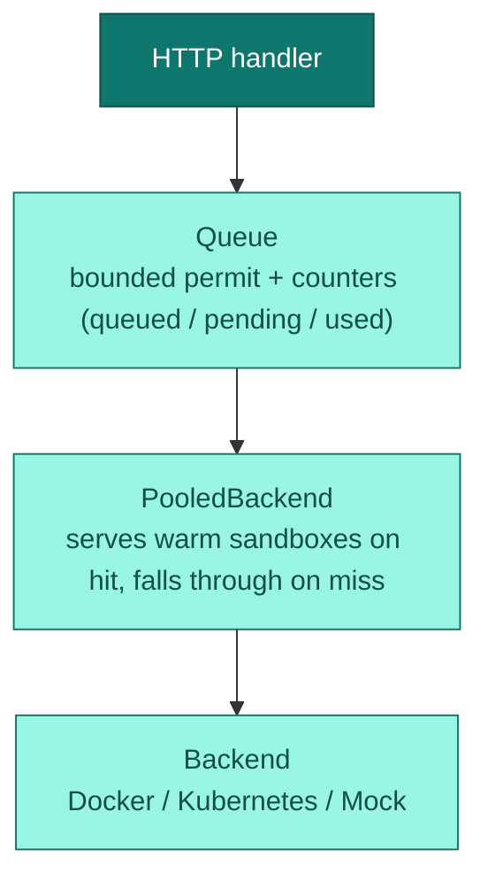

mica's core is a layered pipeline. Every `POST /wd/hub/session` flows through
the same stack regardless of where browsers actually run:

## The queue

A single semaphore enforces the hard session cap (`--limit`). Three counters —
`queued`, `pending`, `used` — are surfaced on `/status` and `/ping` so
dashboards and autoscalers see real capacity, not guesses.

By default a create request **blocks** until a slot frees up. Two escape
hatches:

- `--disable-queue` makes mica fail the create instead of blocking.
- The `X-Mica-No-Wait: 1` request header on `POST /wd/hub/session` does the
  same for that one request.

Both escape hatches return HTTP `500` with the W3C error
`session not created` and the message `queue is full` — mica maps every
non-`invalid argument` / `invalid session id` WebDriver error to `500`, so
retry on the error string, not on a `429`/`503` status.

## Warm pool

`PooledBackend` wraps any backend and serves pre-started browsers keyed by
`(image, screen_resolution, env_hash)`. On a pool hit the client gets a
session in milliseconds; on a miss it falls through to a cold start. Enabled
with `--warm-pool-min > 0` — see the [warm pool guide](/guides/warm-pool).

## Session lifecycle

1. **Quota check** — if per-user [quotas](/guides/admin#quotas) are
   configured, they are enforced *before* a queue slot is consumed, so an
   over-quota create fails fast.
2. **Queue permit** acquired (or the request waits / is rejected).
3. **Backend start** — container/pod is created, mica waits up to
   `--service-startup-timeout` for the WebDriver port, and retries the
   upstream session create `--retry-count` times on 5xx.
4. **Proxying** — all `/wd/hub/session/{id}/...` traffic streams through to
   the browser. Auxiliary endpoints (VNC, DevTools, clipboard, downloads)
   attach to the same session.
5. **Idle watching** — each session owns a watcher task. No traffic for the
   idle timeout (`--timeout`, overridable per session via
   `mica:options.sessionTimeout`, capped at `--max-timeout`) tears the
   session down.
6. **Teardown** — on `DELETE`, idle timeout, or shutdown: the queue permit is
   released, the container is stopped, and a `SessionStopped` event fires
   (which triggers artifact upload if configured).

## Hot reload and graceful shutdown

- **SIGHUP** atomically swaps the browser registry (`browsers.json`), user
  file, and quota file with zero downtime — in-flight sessions are untouched.
- **SIGTERM / SIGINT** stops accepting new connections, then drains: every
  live session is torn down cleanly within `--graceful-period` (default
  300s).

## Events

An internal event bus fans out `FileCreated` and `SessionStopped` events to
listeners (S3 uploader, plugins, the admin SSE stream). Each emit is
delivered on its own task, so a slow consumer can never stall session
traffic.
