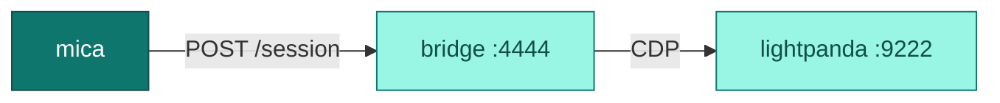

mica runs any WebDriver-speaking browser image (Selenoid images work
out of the box). The repository additionally maintains purpose-built images,
published to GHCR by CI from the `browser-images.json` manifest at the repo
root.

## chrome-headless-shell (~80 MB)

Chrome for Testing's `chrome-headless-shell` binary (Chrome ≥ 120) with no
X11, no Wayland, no D-Bus — roughly 80 MB against ~300 MB for full Chrome.
Built for [warm pool](/guides/warm-pool) economics: small pulls, fast boots.

<Warning>
  **This image exposes CDP on 9222, not WebDriver, so it cannot serve
  sessions as-is.** Its entrypoint is `chrome-headless-shell
  --remote-debugging-port=9222`; no `chromedriver` is installed. mica builds
  each upstream as `http://<ip>:<port><path>` and POSTs `/session` to it, so
  a `browsers.json` entry pointing at `9222` fails every create. Registering
  it requires a WebDriver server in front of the browser — add `chromedriver`
  to a derived image, point `port` at that driver's port (`4444`, which the
  image already `EXPOSE`s), and keep `path` empty. The size and warm-pool
  numbers below still hold for such a derived image.
</Warning>

```json
{
  "chrome": {
    "default": "126.0.6478.182",
    "versions": {
      "126.0.6478.182": {
        "image": "your-registry/chrome-headless-shell-with-driver:126.0.6478.182",
        "port": "4444",
        "path": "",
        "shmSize": 2147483648
      }
    }
  }
}
```

<Note>
  **amd64 only** — Chrome for Testing publishes no `linux-arm64`
  `chrome-headless-shell` binary.
</Note>

`shmSize` is optional: mica's Docker backend defaults `/dev/shm` to 2 GiB
(Chrome's stock 64 MB crashes under load).

## Lightpanda (ultra-light, CDP-native)

[Lightpanda](https://lightpanda.io) is an ultra-light headless browser built
for AI/automation workloads — milliseconds startup, a fraction of Chrome's
memory. It speaks CDP, not WebDriver, so mica's image wraps it with a thin
WebDriver-classic bridge (Node + `puppeteer-core`) — from mica's point of
view it is an ordinary WebDriver browser:



```json
{
  "lightpanda": {
    "default": "nightly",
    "versions": {
      "nightly": {
        "image": "ghcr.io/0xteamhq/lightpanda:nightly",
        "port": "4444",
        "path": ""
      }
    }
  }
}
```

<Warning>
  For this image `path` must be **empty**, not `"/"`. mica builds the
  upstream URL as `host:port + path` then appends `/session`; a `"/"` yields
  a double slash the bridge's router won't match. (chromedriver-based images
  tolerate it, which is why some example configs get away with `"/"`.)
</Warning>

The bridge implements the commonly-used slice of WebDriver-classic
(navigation, elements, screenshots, script execution). Use it for the cheap
tier — scraping, smoke checks, AI agents — and full Chrome where fidelity
matters.

## chromium-recorder (the one that records)

`docker/chromium-recorder` is the reference **recording-capable** image, and
the one to use when you want `enableVideo` to actually produce an `.mp4`. It
bundles what the headless images above deliberately omit: `chromedriver` on
`4444`, Chromium on an Xvfb display, and `ffmpeg` capturing that display to
`/video/${FILE_NAME}.mp4` when mica sets `ENABLE_VIDEO=true`.

<Note>
  It is **not** in `browser-images.json`, so CI does not publish it to GHCR —
  build it yourself and reference the local tag:

  ```bash
  docker build -t mica/chromium-recorder docker/chromium-recorder
  ```

  Then register it with `"port": "4444"` and `"path": ""`.
</Note>

Pair it with `--video-output-dir` and see [artifacts](/guides/artifacts) for
the recording pipeline and its silent-failure modes.

## Bring your own image

Any image that exposes a WebDriver endpoint works. Point `browsers.json` at
it (`image`, `port`, `path`) and mica handles lifecycle, proxying, and
artifacts. See the [browsers.json reference](/reference/browsers-json).

## How releases work

`browser-images.json` at the repo root is the manifest; a shared GitHub
Actions workflow builds and pushes `ghcr.io/0xteamhq/<name>:<version>`
(plus `:latest`) whenever the manifest or `docker/**` changes on `main`.
Cutting a new image version is a one-line manifest change.
