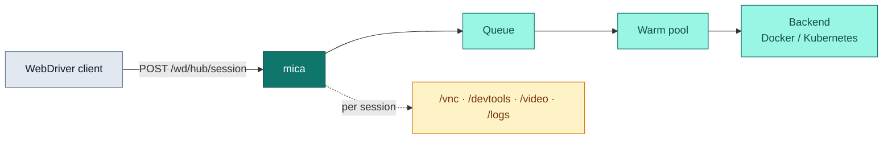

mica is a browser grid that speaks the W3C WebDriver wire format. It runs as a
single Rust binary — on a laptop, a single VM, Kubernetes, or behind any L7
load balancer — and launches isolated browser containers on demand.

If you have used the Aerokube stack, mica consolidates the whole suite into
one artifact: session orchestration (Selenoid), Kubernetes scale (Moon),
stateless routing (GGR), aggregated status (ggr-ui), and an admin dashboard.

## Why mica

<CardGroup cols={2}>
  <Card title="One binary" icon="box">
    No companion services, no agents on browser nodes. The artifact you run
    locally is what runs in production.
  </Card>
  <Card title="W3C WebDriver wire" icon="plug">
    Selenium, WebdriverIO, `thirtyfour`, and any other W3C WebDriver client
    work without changes. Point them at `/wd/hub`.
  </Card>
  <Card title="Scales 0 → N" icon="arrow-up-right-dots">
    Docker and Kubernetes backends, pluggable isolation (runc, gVisor, Kata,
    microVMs), and a built-in stateless router tier for multi-node fleets.
  </Card>
  <Card title="Production surface built in" icon="gauge">
    `/healthz` + `/readyz` probes, Prometheus `/metrics`, structured JSON
    logs, graceful drain on SIGTERM, hot config reload on SIGHUP, S3 artifact
    upload, and a warm pool for sub-second session starts.
  </Card>
</CardGroup>

## How it fits together

A WebDriver client creates a session against mica; mica queues the request,
starts (or reuses, via the [warm pool](/guides/warm-pool)) a browser
container, and proxies all session traffic to it. Auxiliary per-session
endpoints expose VNC, DevTools (CDP), video, logs, clipboard, and downloads.

For multi-node fleets, the same binary runs as a stateless
[router](/guides/router) in front of N mica nodes — no shared state, no
sticky load balancing required.

## Next steps

<CardGroup cols={2}>
  <Card title="Quickstart" icon="rocket" href="/quickstart">
    Run mica with Docker, Helm, or from source in under five minutes.
  </Card>
  <Card title="Connect your test client" icon="flask" href="/guides/clients">
    Selenium, WebdriverIO, and raw `curl` examples.
  </Card>
  <Card title="Architecture" icon="diagram-project" href="/concepts/architecture">
    Queue, warm pool, backends, and the session lifecycle.
  </Card>
  <Card title="Endpoint map" icon="map" href="/reference/endpoints">
    Every HTTP surface mica exposes, at a glance.
  </Card>
</CardGroup>
